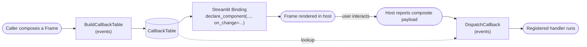

# Core Domain Distillation — Tiferet MUI

**Status:** Draft · **Domain:** `tiferet-mui` · **Code:** `tiferet_mui/` · **Branch:** `docs-core-domain-and-binding`
**Companion:** `docs/domain-vision.md`

## 1. Purpose of this document

The vision statement says *what* Tiferet MUI is for and why it is worth building. This document says *how the domain will actually work*: the vocabulary, the behaviors, the rules those behaviors enforce, and the relationships between the parts. It is the reference a contributor should read before drafting or implementing a change to this package, and the reference a reviewer should read before judging whether a change belongs. It represents the ideal model description for this version of the domain; specification documents that propose changes should cite this document, not the other way around.

**This is a forward-looking distillation.** As of this writing the repository contains no package code — `git log` shows only the initial commit (`LICENSE`, `README.md`) plus this branch's two documentation additions. There is no `tiferet_mui/` directory, no `pyproject.toml`, and none of the modules named below exist yet. Every module path in this document is a **planned** location, not a verified citation, and is marked as such. Nothing here should be read as an assertion that code currently behaves a given way.

Because there is no implementation to read, every claim below is grounded in one of two kinds of source instead of code:

1. **This package's own design record** — the architecture decisions already settled in the planning discussion that produced this repository's current two documents (referred to throughout as "the architecture plan"), which fixes the package layout, the layer set, and the glossary this document reuses.
2. **Verifiable external facts** about the problem this package solves:
   - [`okld/streamlit-elements#35`](https://github.com/okld/streamlit-elements/issues/35) — "onChange event not working on Streamlit 1.34," opened 2024-05-21, **still open**. The thread's own history is the evidence for the vision statement's claim that the only available fixes are private-module import patches (e.g. importing `custom_component` in place of the module's broken `components` import) that keep breaking across Streamlit releases (1.34, 1.40) and require reapplication by each affected app.
   - [`streamlit/streamlit#8633`](https://github.com/streamlit/streamlit/pull/8633) — "Allow passing on_change_callback for CustomComponents," merged 2024-05-22, shipped in Streamlit 1.36. This is the PR that added the public, supported `on_change` keyword argument to a component instance call (`declare_component(...)(..., on_change=callback)`), replacing the private-attribute patches the `#35` thread had been trading. It is the "supported door" the domain vision statement refers to, and it is the one mechanism this domain is built around.

Once this domain's implementation lands, this document should be revised to replace "planned" module references with verified `path:line` citations, per the standing convention for implemented domains.

## 2. The core domain, restated precisely

Tiferet MUI's core domain is **mediating one render pass of a widget tree and the interactions reported back from it, without depending on a private Streamlit interface.**

A caller composes a tree of widget descriptions once per render. Before that tree is shown, the domain builds a registry mapping every interactive part of it to the handler that should run when it fires. When the host application later reports that something happened, the domain looks up the one handler that claimed that identifier and runs it. Nothing is inferred from a private callback-wiring mechanism inside the host; every handoff happens through data the domain itself declared.

Restated as the vision statement's own shorthand, now given its technical names:

> **Describe** the screen (compose a **Frame**) → **register** who is listening (build the **Callback Table**) → **deliver** each reported interaction to the right listener (**dispatch**).

The domain has exactly one axis of variation:

**Host/dialect** — which UI runtime a given `Frame` is mounted into and which runtime-specific mechanism is used to receive its reported interactions. Streamlit is the only host today, wired through the public `on_change` mechanism from `streamlit/streamlit#8633`. The architecture plan's own "Subdomain isolation rule" names this axis directly: anything specific to a given host is confined to a same-named module per layer (e.g. `streamlit.py`), mirroring how core `tiferet` isolates its CLI dialect rather than scattering `argparse` calls across otherwise-generic layers. A second host, if one is ever added, would get its own sibling modules under this same rule — it would not change the shape of `Element`, `Frame`, or the `Callback Table`.

Everything else — describing a tree of widgets, assigning identifiers to its interactive parts, building and freezing the registry, and routing a reported interaction back to exactly one handler — is meant to be identical regardless of host. That asymmetry is the single most important design commitment this document records, and Section 8 treats it directly.

## 3. Ubiquitous language

**Element** — a single widget node in a described screen: its tag/type, its props, and its children. An `Element` carries no behavior of its own; it is data describing what should appear.

**Frame** — the composed tree of `Element`s for one render pass. A `Frame` is rebuilt every time the screen is described, so what is on screen and what can respond to it can never silently drift apart.

**Callback Table** — the `callback_id → handler` mapping rebuilt from a `Frame`'s interactive elements on every render pass. It is the registry that makes "register who is listening" a real, inspectable artifact rather than an implicit side effect of composing the screen.

**Binding** — the dialect-specific handler that a host's blueprint module (a `blueprints/<dialect>.py`, e.g. `blueprints/streamlit.py`) builds: a plain callable that mounts a `Frame` in that host and dispatches whatever interactions it reports. A consumer's own session or view context wires this callable in as one of its runtime-handler slots. Tiferet MUI itself never owns that session — the `Binding` is the entire surface it hands back.

Every other term used later in this document (`StateService`, `CallbackTableAggregate`, `FrameTransferObject`, `DomainEvent`) is a Tiferet framework term used in its ordinary framework sense, not a domain-specific coinage, so it is not repeated in this glossary.

## 4. What the domain operates on

**Inputs:**
- A caller-authored `Frame`: a tree of `Element`s assembled fresh on each render pass. The caller decides what widgets exist and what props they carry; the domain does not generate this tree.
- A `StateService`-backed store for session-scoped values needed across reruns (e.g. the last known value of a stateful widget), resolved by dialect flag through `tiferet`'s own `DIContext`/`ServiceConfiguration`/`FlaggedDependency` mechanism rather than hard-wired to Streamlit.
- The composite interaction payload the mounted host component reports back once a user acts on it. **The exact shape of this payload is not yet confirmed** — the architecture plan flags this explicitly as an assumption a rendering-strategy spike must settle before implementation, since the `okld/streamlit-elements` frontend bundle being reused was originally built for a different, now-broken callback design. Until that spike runs, the `StateService` contract and `DispatchCallback` payload assumptions below are provisional.

**The convention that gives the domain its leverage** is the pairing of description and registration in a single pass: a `callback_id` is assigned to an interactive `Element` at the moment its owning `Frame` is composed, not afterward. This is what lets one small, generic dispatch step — rather than a per-widget-type dispatcher — route any reported interaction to its handler. It is also what makes an interaction reported against no registered id a detectable, reportable error instead of a silently ignored event, per the vision statement's "failure stops being silent" commitment.

## 5. The behaviors

Three bounded steps carry the domain end to end. The first two are planned as `DomainEvent` subclasses in `tiferet_mui/events/` (paths below are planned, not yet-existing files); the third is the dialect-specific edge that invokes them. No `feature.yml`-declared pipeline is planned for this package — see Section 6 for why.

### 5.1 Build the Callback Table
*Walk a composed `Frame`'s `Element` tree, assign a `callback_id` to each interactive element, and freeze the result into an immutable `CallbackTable`.*

Planned as `BuildCallbackTable`, a `DomainEvent` subclass living at `tiferet_mui/events/` (module not yet named beyond "events layer" in the architecture plan). It is expected to build a mutable `CallbackTableAggregate` (`tiferet_mui/mappers/`) while walking the tree, then freeze it into the read-only `CallbackTable` domain object (`tiferet_mui/domain/`) that later steps consume. Being a `DomainEvent` subclass gives it `verify`/`raise_error`/`parameters_required` and the `DomainEvent.handle()` test harness for free, per framework convention.

**Verdict: agnostic.** Nothing about walking an `Element` tree and assigning identifiers depends on which host will eventually mount the result. This step is the concrete instance of the "id declared as data, resolved via lookup, executed by one generic executor" idiom the architecture plan calls out by name.

### 5.2 Dispatch a reported callback
*Resolve a `callback_id` out of an incoming composite interaction payload and invoke the one handler registered against it.*

Planned as `DispatchCallback`, also a `DomainEvent` subclass in `tiferet_mui/events/`. Its job is strictly a lookup-and-invoke: given the current `CallbackTable` and a reported payload, find the `callback_id` inside that payload, and call the handler the `CallbackTable` has for it — raising a domain error rather than failing silently if the id is unrecognized (echoing the vision statement's "an interaction that arrives with no one listening is a reported error, not a shrug").

**Verdict: agnostic**, with one caveat carried over from Section 4: the *shape* of the incoming payload this event parses is provisional until a rendering-strategy spike confirms it. The lookup-and-invoke mechanism itself does not depend on the host; the field names inside the payload it reads might, until confirmed otherwise.

### 5.3 Mount the Frame and receive its reports (the Streamlit Binding)
*Declare the vendored component instance with the host's public `on_change` mechanism, and close over `BuildCallbackTable`/`DispatchCallback` to produce one plain callable.*

Planned to live in `tiferet_mui/blueprints/streamlit.py`, the dialect entrypoint and (along with `tiferet_mui/utils/streamlit.py`) one of only two modules in the whole package permitted to import `streamlit`, per the Subdomain isolation rule. It is expected to call `declare_component(...)(...)` with the `on_change` keyword introduced by `streamlit/streamlit#8633`, invoke `BuildCallbackTable` and `DispatchCallback` directly (no context object needed, since this package owns no session), and return a plain callable — the `Binding`. That callable is what a host's own session context (e.g. a `tiferet-streamlit` `ViewContext`) wires in as a runtime-handler slot.

**Verdict: variable.** This is the one behavior whose entire reason for existing is a specific host's API. A second host would need its own sibling module implementing this same behavior against that host's own interaction mechanism; nothing here generalizes.

## 6. How the behaviors compose

Unlike domains that declare their pipeline in a `feature.yml` read by `FeatureContext`, this package has no `repos/` layer and therefore no YAML-declared pipeline — the architecture plan is explicit that DI configuration here is small enough to be declared as in-code `ServiceConfiguration` objects, and there are no other consumer-facing sequencing points that would justify config-driven orchestration. Composition instead happens as a direct call sequence, assembled by `tiferet_mui/blueprints/core.py` (dialect-agnostic: resolves the DI-backed `StateService` and returns a handler-building function) and closed over by the dialect entrypoint in `blueprints/streamlit.py`.

The sequence, once implemented, is expected to be:

`BuildCallbackTable` runs once per render pass, ahead of mounting. The Streamlit Binding then owns the runtime loop of mounting and receiving reports for that pass; each report re-enters through `DispatchCallback` against the `CallbackTable` already built for that pass.

## 7. Relationships / cross-boundary rules

**Tiferet MUI supplies a handler; it does not own a session.** The architecture plan states this as the governing reason the package has no `contexts/` layer at all: `tiferet-streamlit` (or any other consumer) already owns its own session/view context, and a competing session hub inside `tiferet-mui` would leave two hubs fighting over the same running app. Instead, the package uses the same **runtime-handler-slot** shape the framework already relies on elsewhere — a handler is built and handed back for a host's own session context to wire in, the same relationship core `tiferet` uses to add CLI argument parsing to `AppSessionContext` without CLI needing its own session class, per the architecture plan.

**`di/` exists; `repos/` does not.** Resolving a dialect-specific `StateService` (Streamlit today, potentially another host later) is exactly the flagged-dependency problem `tiferet`'s `DIContext`/`ServiceConfiguration`/`FlaggedDependency` already solves. No YAML-declared configuration is planned, so the `repos/` layer that would otherwise read it is excluded outright.

**No `BindingService` interface.** `interfaces/` is planned to declare only `StateService` (an ABC with `get`/`set`). The architecture plan deliberately does *not* introduce a `BindingService` contract: mounting a component is irreducibly dialect-specific and will only ever have one implementation per host, so it is not a DI-swapped contract — it lives as plain functions in the dialect's own blueprint module, consistent with the framework convention that blueprints are module-level functions rather than injected services.

**Dependency direction on other Tiferet-family packages.** Tiferet MUI depends on `tiferet` and (optionally) `streamlit` only. It never imports or depends on `tiferet-streamlit`, and it defines no vocabulary of features, views, or pages — that vocabulary belongs entirely to `tiferet-streamlit`, and judging whether a proposed addition to this package belongs here requires checking it against that boundary specifically (Section 9 names it again as an explicit exclusion).

**Judging any of the above requires the plan itself as input**, in the same sense a compiler's relationship rules require knowing a file's declared component type before a given import can be judged valid or invalid: none of these constraints are enforced by any tooling yet (there is no code to enforce them against), so until this domain is implemented, this document and the architecture plan it is grounded in are the only recorded source of truth for which relationships are permitted.

## 8. The agnostic core and the variable edge

Stated plainly, per the split the architecture plan already commits to, so future work can be scoped against it:

**Agnostic — build once, never per host:**
- `domain/` — `Element`, `Frame`, `CallbackTable`. Zero framework imports.
- `mappers/` — `CallbackTableAggregate`, `FrameTransferObject`.
- `interfaces/` — the `StateService` ABC's shape (its `get`/`set` contract), independent of which host backs a concrete implementation.
- `events/` — `BuildCallbackTable`, `DispatchCallback`. Both host-agnostic `DomainEvent` subclasses per Section 5.
- `assets/core.py` — the `CALLBACK_NOT_FOUND_ID`/`CALLBACK_NOT_FOUND_DATA` error definition and the `state_service` flagged service-registration data, both host-agnostic data structures exported as standalone constants (no pre-assembled groups-catalog dict, since this package has no internal bootstrap of its own to consume one). Exported specifically so a consuming app can key them into its own error catalog and DI configuration instead of redefining them.

**Variable — one definition per host/dialect:**
- `utils/streamlit.py` — `StreamlitState(StateService)`, wrapping `st.session_state`; the frontend-bundle path resolver used by `declare_component(path=...)`.
- `blueprints/streamlit.py` — the Streamlit `Binding`: the `declare_component` wiring, the `on_change` mechanism, and the closure that ties `BuildCallbackTable`/`DispatchCallback` to that specific host's reporting mechanism.

**Honest entanglement inventory.** Because no code exists yet, there is nothing to cite at `path:line` — the inventory that would normally appear here once implementation lands is instead a list of the specific points where this seam is at risk of being violated *when* code is written, so that implementation review can check for exactly these things:

1. **`blueprints/core.py` must stay import-clean of `streamlit`.** The architecture plan positions it as the dialect-agnostic composition helper that resolves the DI-backed `StateService` and hands back a handler-building function. If a future implementation imports `streamlit` there directly — even for a type hint or a convenience default — the agnostic/variable line drawn in this section stops being true in practice, regardless of what this document says.
2. **The `CallbackTable`/`DispatchCallback` payload contract is provisional, not yet agnostic in a verified sense.** Section 4 and Section 5.2 already flag that the incoming interaction payload's shape is an open question pending a rendering-strategy spike. If the confirmed shape turns out to require host-specific fields to reach `DispatchCallback` correctly, the "agnostic" verdict given to that event in Section 5.2 would need to be revisited before it is implemented as currently scoped.
3. **Subdomain isolation is a naming convention, not an enforced rule.** Nothing described in the architecture plan mechanically prevents a future second-host module from importing `assets/streamlit/`'s vendored bundle or `utils/streamlit.py` by mistake — the isolation depends entirely on contributors following the "only `<layer>/streamlit.py` imports `streamlit`" convention by hand. This is worth recording now, before any code exists to audit, as the first thing a code-review pass against this domain's implementation should check by eye.

## 9. Boundaries

**Inside the domain:** describing a screen as a `Frame` of `Element`s; building and freezing a `CallbackTable` for one render pass; dispatching a reported interaction to exactly the handler registered for it; and — for exactly one host today — mounting that `Frame` and receiving its reports through a supported public mechanism.

**Outside the domain, with an explicit owner for each:**
- **Application session and lifecycle ownership** — the host application's own session or view context (e.g. `tiferet-streamlit`'s `ViewContext`). Tiferet MUI hands back a plain callable; it never runs the show itself.
- **Features, views, and pages** — entirely `tiferet-streamlit`'s vocabulary. This domain has no concept of any of them and never will, per the vision statement's stated non-goals.
- **Being a fork, patch, or rescue of `okld/streamlit-elements`** — this domain reuses that project's compiled frontend bundle as a vendored asset (Section 8, `assets/streamlit/`), but owns none of its Python-side callback logic and does not track or fix that upstream project.
- **General-purpose Streamlit component authoring** — this domain solves one specific wiring problem for one specific set of widget libraries (Material UI, Nivo, Monaco); it is not a framework for building arbitrary Streamlit components.
- **The widgets themselves** — Material UI, Nivo, and Monaco's own rendering and behavior are the vendored frontend bundle's concern, not this domain's. This domain owns only the wiring that gets interactions out of them and back to a handler.

## 10. Where this leads

Each item below is a candidate slice of future implementation work, stated so it can be scoped and sequenced independently:

1. **Rendering-strategy spike & repo scaffold.** Confirm the composite payload shape the unmodified `okld/streamlit-elements` frontend bundle reports through the new public `on_change` mechanism, and establish the package skeleton (`pyproject.toml`, vendored bundle plus license attribution under `assets/streamlit/`) everything else depends on. This resolves the open question flagged in Sections 4, 5.2, and 8.
2. **Domain & mapper layer.** Implement `Element`, `Frame`, `CallbackTable` as domain objects and `CallbackTableAggregate`/`FrameTransferObject` as mappers, sized against the payload shape item 1 confirms.
3. **Events layer.** Implement `BuildCallbackTable` and `DispatchCallback` as `DomainEvent` subclasses with `DomainEventTestBase` coverage, turning Section 5.1 and 5.2's agnostic verdicts into tested code, alongside the `CALLBACK_NOT_FOUND_ID`/`CALLBACK_NOT_FOUND_DATA` error definition `DispatchCallback` raises against.
4. **Interfaces & DI.** Implement the `StateService` ABC and the `di/` layer resolving it by dialect flag, turning Section 7's DI relationship rules into working `ServiceConfiguration`/`FlaggedDependency` code, backed by a consumer-importable service-registration constant in `assets/core.py`.
5. **Streamlit binding.** Implement `utils/streamlit.py` (`StreamlitState`), `blueprints/core.py`, and `blueprints/streamlit.py` — the one behavior this document marks fully variable (Section 5.3, Section 8) — plus an end-to-end working demo.
6. **Widget catalog v0 & release polish.** Ship the first real MUI `Element` factories (e.g. Button, TextField, Box) needed to make item 5's demo useful, and finalize README/`AGENTS.md`.
7. **Style library demo.** Expand the widget catalog with a few more factories (e.g. icon, card, label/typography) and ship a runnable gallery-style demo enumerating every available widget, giving a newcomer a single reference for what the package currently supports, distinct from item 5's task-oriented proof of the binding mechanism.

Together these seven items are the difference between the domain this document describes and the domain the vision statement promises. Once they land, this document's "planned" citations should be replaced with verified `path:line` references, and the entanglement inventory in Section 8 should be re-audited against real code rather than anticipated risk.
